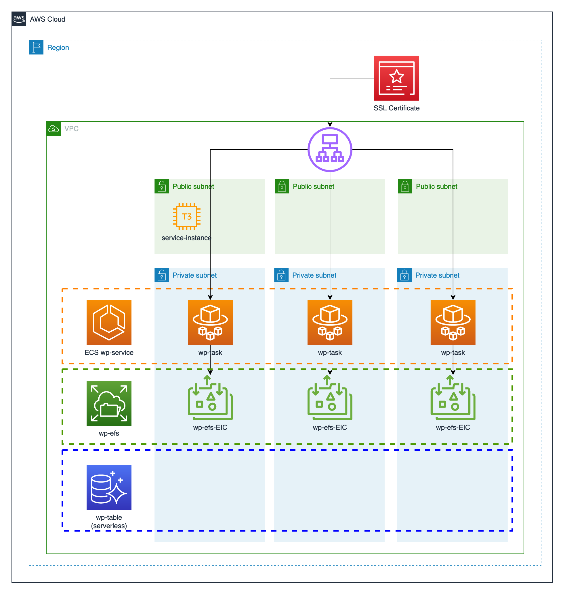

# Serverless HA Wordpress installation on AWS using Terraform <!-- omit in toc --> 
- [1. Architecture overview](#1-architecture-overview)
- [2. Terraform IaC details](#2-terraform-iac-details)
## 1. Architecture overview
Here is an overview of the phases and the resources deployed during installation

## 2. Terraform IaC details

<!-- BEGIN_TF_DOCS -->
## Requirements

| Name | Version |
|------|---------|
|  [terraform](#requirement\_terraform) | >=1.0.10 |
|  [aws](#requirement\_aws) | ~> 3.0 |

## Providers

| Name | Version |
|------|---------|
|  [aws](#provider\_aws) | ~> 3.0 |

## Modules

No modules.

## Resources

| Name | Type |
|------|------|
| [aws_internet_gateway.ad_igw](https://registry.terraform.io/providers/hashicorp/aws/latest/docs/resources/internet_gateway) | resource |
| [aws_route.ad-vpc-r01](https://registry.terraform.io/providers/hashicorp/aws/latest/docs/resources/route) | resource |
| [aws_route_table.ad-vpc-rt](https://registry.terraform.io/providers/hashicorp/aws/latest/docs/resources/route_table) | resource |
| [aws_route_table.ad-vpc-rt-pvt](https://registry.terraform.io/providers/hashicorp/aws/latest/docs/resources/route_table) | resource |
| [aws_route_table_association.ad-rt-association-1](https://registry.terraform.io/providers/hashicorp/aws/latest/docs/resources/route_table_association) | resource |
| [aws_route_table_association.ad-rt-association-2](https://registry.terraform.io/providers/hashicorp/aws/latest/docs/resources/route_table_association) | resource |
| [aws_route_table_association.ad-rt-association-3](https://registry.terraform.io/providers/hashicorp/aws/latest/docs/resources/route_table_association) | resource |
| [aws_route_table_association.ad-rt-pvt-association-1](https://registry.terraform.io/providers/hashicorp/aws/latest/docs/resources/route_table_association) | resource |
| [aws_route_table_association.ad-rt-pvt-association-2](https://registry.terraform.io/providers/hashicorp/aws/latest/docs/resources/route_table_association) | resource |
| [aws_route_table_association.ad-rt-pvt-association-3](https://registry.terraform.io/providers/hashicorp/aws/latest/docs/resources/route_table_association) | resource |
| [aws_subnet.private_subnet_1](https://registry.terraform.io/providers/hashicorp/aws/latest/docs/resources/subnet) | resource |
| [aws_subnet.private_subnet_2](https://registry.terraform.io/providers/hashicorp/aws/latest/docs/resources/subnet) | resource |
| [aws_subnet.private_subnet_3](https://registry.terraform.io/providers/hashicorp/aws/latest/docs/resources/subnet) | resource |
| [aws_subnet.public_subnet_1](https://registry.terraform.io/providers/hashicorp/aws/latest/docs/resources/subnet) | resource |
| [aws_subnet.public_subnet_2](https://registry.terraform.io/providers/hashicorp/aws/latest/docs/resources/subnet) | resource |
| [aws_subnet.public_subnet_3](https://registry.terraform.io/providers/hashicorp/aws/latest/docs/resources/subnet) | resource |
| [aws_vpc.app_vpc](https://registry.terraform.io/providers/hashicorp/aws/latest/docs/resources/vpc) | resource |
| [aws_caller_identity.current](https://registry.terraform.io/providers/hashicorp/aws/latest/docs/data-sources/caller_identity) | data source |

## Inputs

| Name | Description | Type | Default | Required |
|------|-------------|------|---------|:--------:|
|  [app\_name\_prefix](#input\_app\_name\_prefix) | Name of the app/service which will use the CI/CD. Prefix (short) version | `string` | n/a | yes |
|  [app\_name\_verbose](#input\_app\_name\_verbose) | Name of the app/service which will use the CI/CD. Verbose version | `string` | n/a | yes |
|  [app\_repository\_name](#input\_app\_repository\_name) | Name of the repositoy where the IaC and/or app code is stored | `string` | n/a | yes |
|  [aws\_region](#input\_aws\_region) | Name of the region where resources will be deployed | `string` | `"eu-west-1"` | no |
|  [az1](#input\_az1) | Availability Zone 1 | `string` | `"eu-west-1a"` | no |
|  [az2](#input\_az2) | Availability Zone 2 | `string` | `"eu-west-1b"` | no |
|  [az3](#input\_az3) | Availability Zone 3 | `string` | `"eu-west-1c"` | no |
|  [environment](#input\_environment) | Name of the environment in which the CI/CD will deploy (e.g. network, lab, application, DMZ) | `string` | n/a | yes |
|  [private\_subnet\_1](#input\_private\_subnet\_1) | Private subnet AZ1 | `string` | `"10.0.7.0/24"` | no |
|  [private\_subnet\_2](#input\_private\_subnet\_2) | Private subnet AZ2 | `string` | `"10.0.8.0/24"` | no |
|  [private\_subnet\_3](#input\_private\_subnet\_3) | Private subnet AZ3 | `string` | `"10.0.9.0/24"` | no |
|  [public\_subnet\_1](#input\_public\_subnet\_1) | Public subnet AZ1 | `string` | `"10.0.107.0/24"` | no |
|  [public\_subnet\_2](#input\_public\_subnet\_2) | Public subnet AZ2 | `string` | `"10.0.108.0/24"` | no |
|  [public\_subnet\_3](#input\_public\_subnet\_3) | Public subnet AZ3 | `string` | `"10.0.109.0/24"` | no |
|  [stage](#input\_stage) | Name of the stage in which the CI/CD will deploy (e.g. dev, int, prod, test, ephemeral, canary, RC, seed) | `string` | n/a | yes |
|  [vpc\_cidr](#input\_vpc\_cidr) | CIDR for the VPC | `string` | `"10.0.0.0/16"` | no |
|  [vpc\_name](#input\_vpc\_name) | Common name for the VPC | `string` | `"hawp-vpc"` | no |

## Outputs

No outputs.
<!-- END_TF_DOCS -->